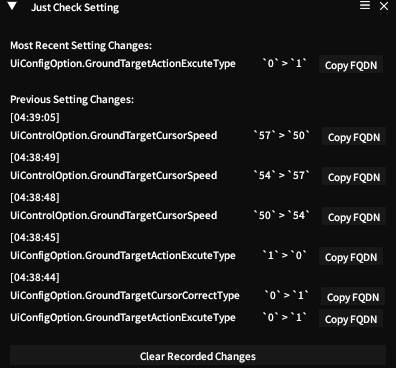

<div align="center">


###  Just Shows FFXIV Setting Changes

To serve in identifying the specific Setting Keys, and how the values map to what
is in the UI.



(and allows you to copy the full Reference to each setting)

#### Repo:

```
https://repo.justsome.site/jsp/main/repo.json
```

</div>

---

    Just-Some-Plugin Just Check Setting: plugin for checking changed settings.
    Copyright (C) 2025  Ethan Henderson (zbee) <ethan@zbee.codes>

     This program is free software: you can redistribute it and/or modify
     it under the terms of the GNU Affero General Public License as published
     by the Free Software Foundation, either version 3 of the License, or
     (at your option) any later version.

     This program is distributed in the hope that it will be useful,
     but WITHOUT ANY WARRANTY; without even the implied warranty of
     MERCHANTABILITY or FITNESS FOR A PARTICULAR PURPOSE. See the
     GNU Affero General Public License for more details.

     You should have received a copy of the GNU Affero General Public License
     along with this program. If not, see <https://www.gnu.org/licenses/>. 
